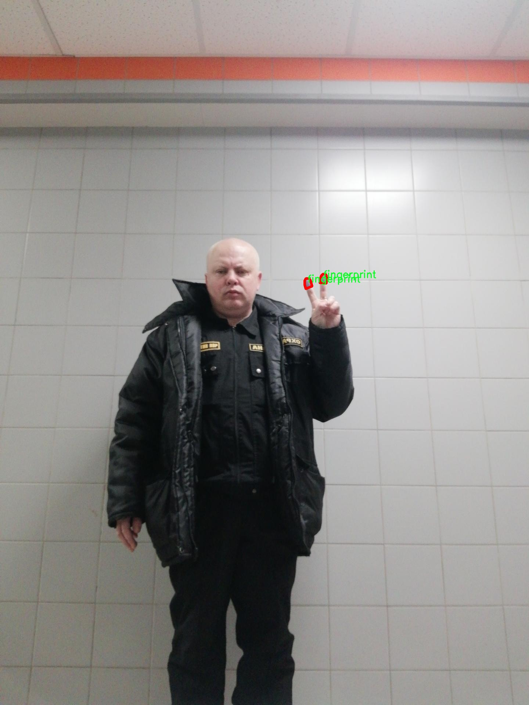

# 指纹图像分割系统： yolov8-seg

### 1.研究背景与意义

[参考博客](https://gitee.com/YOLOv8_YOLOv11_Segmentation_Studio/projects)

[博客来源](https://kdocs.cn/l/cszuIiCKVNis)

研究背景与意义

随着信息技术的迅猛发展，生物特征识别技术在安全性、便利性和高效性等方面的优势愈发显著。指纹作为一种独特的生物特征，因其稳定性和不可复制性，广泛应用于身份验证、门禁系统、金融交易等多个领域。然而，指纹图像的获取和处理并非易事，尤其是在复杂环境下，指纹图像常常受到噪声、模糊、光照变化等因素的影响，导致指纹特征的提取和识别效果不佳。因此，开发一种高效、准确的指纹图像分割系统，成为了指纹识别技术研究中的一个重要课题。

近年来，深度学习技术的迅猛发展为图像处理领域带来了新的机遇。YOLO（You Only Look Once）系列模型因其高效的实时目标检测能力，逐渐成为计算机视觉领域的研究热点。YOLOv8作为该系列的最新版本，具备了更强的特征提取能力和更快的推理速度，能够在复杂场景中实现高精度的目标检测和分割。因此，基于改进YOLOv8的指纹图像分割系统的研究，不仅具有重要的理论意义，也具有广泛的应用前景。

本研究所使用的数据集FHD_Fingerprint包含1200幅指纹图像，属于实例分割的范畴，且仅包含一个类别——指纹。这一数据集的构建为指纹图像分割算法的训练和验证提供了良好的基础。通过对这些图像进行深入分析，可以提取出指纹的关键特征，并在此基础上构建高效的分割模型。相较于传统的图像处理方法，基于YOLOv8的深度学习模型能够更好地适应指纹图像的多样性和复杂性，进而提高分割的准确性和鲁棒性。

在指纹图像分割的研究中，如何有效地处理指纹图像中的噪声和干扰，提升分割精度，是一个亟待解决的问题。通过对YOLOv8模型的改进，结合特定的预处理和后处理技术，可以显著提升指纹图像的分割效果。这不仅有助于提高指纹识别系统的整体性能，也为相关领域的研究提供了新的思路和方法。

此外，指纹图像分割系统的研究成果将对实际应用产生深远影响。在金融、公安、出入境管理等领域，指纹识别技术的应用日益广泛，分割系统的准确性直接关系到身份验证的安全性和可靠性。因此，开发高效的指纹图像分割系统，不仅能够提升指纹识别的效率，还能为社会的安全和稳定提供有力保障。

综上所述，基于改进YOLOv8的指纹图像分割系统的研究，不仅具有重要的学术价值，还有助于推动生物特征识别技术的进步，满足日益增长的安全需求。通过深入探讨指纹图像的特征提取与分割技术，本研究将为指纹识别领域的发展提供新的理论支持和实践指导。

### 2.图片演示


注意：本项目提供完整的训练源码数据集和训练教程,由于此博客编辑较早,暂不提供权重文件（best.pt）,需要按照6.训练教程进行训练后实现上图效果。

### 3.视频演示

[3.1 视频演示](https://www.bilibili.com/video/BV1shBSYJEqj/)

### 4.数据集信息

##### 4.1 数据集类别数＆类别名

nc: 1
names: ['fingerprint']


##### 4.2 数据集信息简介

数据集信息展示

在本研究中，我们使用了名为“FHD_Fingerprint”的数据集，以支持对YOLOv8-seg模型的训练，旨在改进指纹图像的分割系统。该数据集专门针对指纹图像的特征提取和分割任务进行了精心设计，提供了高质量的图像数据，能够有效提升模型在实际应用中的表现。数据集的类别数量为1，类别列表中仅包含“fingerprint”这一类别，表明该数据集专注于指纹图像的处理和分析。

“FHD_Fingerprint”数据集包含多种不同环境下采集的指纹图像，涵盖了多样的指纹特征和纹路，确保了数据的多样性和代表性。这些图像不仅包括清晰的指纹样本，还涵盖了不同光照条件、指纹表面状态以及不同个体的指纹特征，旨在提高模型的泛化能力和鲁棒性。数据集中的图像分辨率高，细节丰富，适合用于深度学习模型的训练，尤其是在图像分割任务中，能够提供充足的训练样本，以便模型能够学习到指纹的细微特征。

在数据集的构建过程中，研究者们采用了严格的标准，确保每张指纹图像都经过精确标注。标注过程不仅包括指纹区域的分割，还考虑了指纹的边缘和细节，使得模型在训练时能够更好地理解指纹的结构和形态。这种高质量的标注为YOLOv8-seg模型的训练提供了坚实的基础，使得模型能够在分割任务中实现更高的准确性和效率。

此外，数据集的设计还考虑到了指纹图像处理中的常见挑战，例如噪声、模糊和遮挡等因素。通过引入这些复杂情况，数据集能够帮助模型在面对真实世界中的指纹图像时，表现出更强的适应能力。这对于指纹识别和安全验证等应用场景尤为重要，因为在实际操作中，指纹图像的质量和条件往往会受到多种因素的影响。

为了确保数据集的可用性和易于访问，研究团队还提供了详细的文档和使用指南，帮助研究人员和开发者快速上手并进行相关实验。这些资源不仅包括数据集的下载链接，还涵盖了数据集的结构、样本说明以及建议的训练参数等信息，旨在促进学术界和工业界对指纹图像分割技术的进一步研究和应用。

总之，“FHD_Fingerprint”数据集为改进YOLOv8-seg指纹图像分割系统提供了强有力的支持。通过利用这一数据集，研究人员能够在指纹图像处理领域取得更为显著的进展，推动相关技术的发展与应用。数据集的高质量和针对性设计，使其成为指纹图像分割研究中不可或缺的重要资源。




### 5.项目依赖环境部署教程（零基础手把手教学）

[5.1 环境部署教程链接（零基础手把手教学）](https://www.bilibili.com/video/BV1jG4Ve4E9t/?vd_source=bc9aec86d164b67a7004b996143742dc)


[5.2 安装Python虚拟环境创建和依赖库安装视频教程链接（零基础手把手教学）](https://www.bilibili.com/video/BV1nA4VeYEze/?vd_source=bc9aec86d164b67a7004b996143742dc)

### 6.手把手YOLOV8-seg训练视频教程（零基础手把手教学）

[6.1 手把手YOLOV8-seg训练视频教程（零基础小白有手就能学会）](https://www.bilibili.com/video/BV1cA4VeYETe/?vd_source=bc9aec86d164b67a7004b996143742dc)


按照上面的训练视频教程链接加载项目提供的数据集，运行train.py即可开始训练



     Epoch   gpu_mem       box       obj       cls    labels  img_size
     1/200     0G   0.01576   0.01955  0.007536        22      1280: 100%|██████████| 849/849 [14:42<00:00,  1.04s/it]
               Class     Images     Labels          P          R     mAP@.5 mAP@.5:.95: 100%|██████████| 213/213 [01:14<00:00,  2.87it/s]
                 all       3395      17314      0.994      0.957      0.0957      0.0843

     Epoch   gpu_mem       box       obj       cls    labels  img_size
     2/200     0G   0.01578   0.01923  0.007006        22      1280: 100%|██████████| 849/849 [14:44<00:00,  1.04s/it]
               Class     Images     Labels          P          R     mAP@.5 mAP@.5:.95: 100%|██████████| 213/213 [01:12<00:00,  2.95it/s]
                 all       3395      17314      0.996      0.956      0.0957      0.0845

     Epoch   gpu_mem       box       obj       cls    labels  img_size
     3/200     0G   0.01561    0.0191  0.006895        27      1280: 100%|██████████| 849/849 [10:56<00:00,  1.29it/s]
               Class     Images     Labels          P          R     mAP@.5 mAP@.5:.95: 100%|███████   | 187/213 [00:52<00:00,  4.04it/s]
                 all       3395      17314      0.996      0.957      0.0957      0.0845


### 7.50+种全套YOLOV8-seg创新点加载调参实验视频教程（一键加载写好的改进模型的配置文件）

[7.1 50+种全套YOLOV8-seg创新点加载调参实验视频教程（一键加载写好的改进模型的配置文件）](https://www.bilibili.com/video/BV1Hw4VePEXv/?vd_source=bc9aec86d164b67a7004b996143742dc)

### YOLOV8-seg算法简介

原始YOLOv8-seg算法原理

YOLOv8-seg算法是YOLO系列的最新进展，旨在同时实现目标检测和实例分割任务。作为一种先进的计算机视觉模型，YOLOv8-seg在保持高效性和准确性的同时，结合了YOLOv8的核心设计理念，展现出更为卓越的性能。其基本原理是将目标检测与图像分割任务统一在一个框架内，通过改进的网络结构和新的损失函数，使得模型在复杂场景下能够更好地识别和分割目标。

YOLOv8-seg的网络结构主要由三个部分组成：主干网络（backbone）、特征增强网络（neck）和检测头（head）。在主干网络中，YOLOv8-seg依然采用了CSP（Cross Stage Partial）结构，这种设计使得网络能够有效地提取多层次的特征信息，同时减少了计算量。CSP结构通过引入跨阶段的连接，能够在保持模型性能的同时，降低参数数量，从而提高了模型的计算效率。

特征增强网络部分，YOLOv8-seg引入了PAN-FPN（Path Aggregation Network - Feature Pyramid Network）的思想。这一设计旨在增强不同尺度特征之间的融合能力，使得模型能够更好地处理各种大小的目标。通过对特征图进行有效的融合，YOLOv8-seg能够在不同层次上捕捉到丰富的上下文信息，从而提升目标检测和分割的精度。

在检测头部分，YOLOv8-seg采用了解耦头的设计，将目标分类和边界框回归任务分开处理。这种解耦的方式使得模型能够更专注于各自的任务，减少了任务之间的干扰，从而在复杂场景下提高了定位的准确性和分类的可靠性。与传统的耦合头相比，解耦头的设计使得YOLOv8-seg在处理多目标和小目标时表现得更加优异。

YOLOv8-seg的一个重要创新在于其采用了Anchor-free的目标检测方法。这种方法不再依赖于预定义的锚框，而是通过回归方式直接预测目标的位置和大小。这一转变使得模型在处理不同尺度和形状的目标时，能够更加灵活和高效。通过这种方式，YOLOv8-seg能够快速聚焦于目标的邻近区域，从而使得预测框更接近于实际的边界框，进一步提升了检测精度。

此外，YOLOv8-seg在损失函数的设计上也进行了创新。模型引入了变焦损失（Focal Loss）来计算分类损失，同时使用数据平均保真度损失和完美交并比损失来计算边界框损失。这种新的损失策略能够有效地处理类别不平衡问题，使得模型在训练过程中更加关注难以分类的样本，从而提高了整体的检测性能。

YOLOv8-seg还特别针对实例分割任务进行了优化。通过在检测头中引入分割分支，模型能够在检测目标的同时，生成精确的分割掩码。这一特性使得YOLOv8-seg不仅能够识别目标的类别和位置，还能够为每个目标生成高质量的分割结果，极大地扩展了其应用场景。

总的来说，YOLOv8-seg算法在YOLOv8的基础上，通过一系列的结构优化和创新，提升了目标检测和实例分割的能力。其高效的计算性能和优越的检测精度，使得YOLOv8-seg成为当前计算机视觉领域中最具竞争力的模型之一。无论是在实时检测、视频监控，还是在自动驾驶、医疗影像分析等领域，YOLOv8-seg都展现出了广泛的应用潜力和价值。通过对YOLOv8-seg的深入研究与应用，未来的计算机视觉任务将能够实现更高的智能化和自动化水平，为各行各业带来更为显著的效益。


### 9.系统功能展示（检测对象为举例，实际内容以本项目数据集为准）

图9.1.系统支持检测结果表格显示

  图9.2.系统支持置信度和IOU阈值手动调节

  图9.3.系统支持自定义加载权重文件best.pt(需要你通过步骤5中训练获得)

  图9.4.系统支持摄像头实时识别

  图9.5.系统支持图片识别

  图9.6.系统支持视频识别

  图9.7.系统支持识别结果文件自动保存

  图9.8.系统支持Excel导出检测结果数据


### 10.50+种全套YOLOV8-seg创新点原理讲解（非科班也可以轻松写刊发刊，V11版本正在科研待更新）

#### 10.1 由于篇幅限制，每个创新点的具体原理讲解就不一一展开，具体见下列网址中的创新点对应子项目的技术原理博客网址【Blog】：


[10.1 50+种全套YOLOV8-seg创新点原理讲解链接](https://gitee.com/qunmasj/good)

#### 10.2 部分改进模块原理讲解(完整的改进原理见上图和技术博客链接)【如果此小节的图加载失败可以通过CSDN或者Github搜索该博客的标题访问原始博客，原始博客图片显示正常】
### YOLOv8简介
YOLOv8目标检测算法继承了YOLOv1系列的思考,是一种新型端到端的目标检测算法,尽管现在原始检测算法已经开源,但是鲜有发表的相关论文.YOLOv8的网络结构如图所示,主要可分为Input输入端、Backbone骨干神经网络、Neck 混合特征网络层和Head预测层网络共4个部分.

YOLO目标检测算法是一种端到端的One-Slage 目标检测算法，其核心思想是将图像按区域分块进行预测。YOLO将输入图像按照32x32的大小划分成若干个网格，例如416x416的图像将被划分为13x13个网格。当目标物体的中心位于某个网格内时,该网格就会负责输出该物体的边界框和类别置信度。每个网格可以预测多个边界框和多个目标类别,这些边界框和类别的数量可以根据需要进行设置。YOLO算法的输出是一个特征图,包含了每个网格对应的边界框和类别置信度的信息呵。本文采用YOLO最新的YOLOv8模型，其是2022年底发布的最新YOLO系列模型，采用全新的SOTA模型，全新的网络主干结构,如图1所示。
整个网络分为Backbone 骨干网络部分和Head头部网络部分。YOLOv8汲取了前几代网络的优秀特性，骨干网络和 Neck部分遵循CSP的思想，将YOLOv5中的C3模块被替换成了梯度流更丰富C2模块,去掉YOLOv5中 PAN-FPN上采样阶段中的卷积结构,将Backbone不同阶段输出的特征直接送入了上采样操作,模型提供了N/S/M/L/X尺度的不同大小模型,能够满足不同领域业界的需求。本文基于YOLOv8模型设计番茄病虫害检测系统，通过配置模型参数训练番茄图像,得到能够用于部署应用的最优模型。


### 感受野注意力卷积（RFAConv)
#### 标准卷积操作回顾
标准的卷积操作是构造卷积神经网络的基本构件。它利用具有共享参数的滑动窗口提取特征信息，克服了全连通层构造神经网络固有的参数多、计算开销大的问题。设 X R∈C×H×W
表示输入特征图，其中C、H、W分别表示特征图的通道数、高度、宽度。为了清楚地演示卷积核的特征提取过程，我们使用 C = 1 的例子。从每个接受域滑块中提取特征信息的卷积运算可以表示为:


这里，Fi 表示计算后每个卷积滑块得到的值，Xi 表示每个滑块内对应位置的像素值，K表示卷积核，S表示卷积核中的参数个数，N表示接收域滑块的总数。可以看出，每个滑块内相同位置的 feature共享相同的参数Ki。因此，标准的卷积运算并不能捕捉到不同位置所带来的信息差异，这最终在一定程度上限制了卷积神经网络的性能。 

#### 空间注意力回顾
目前，空间注意机制是利用学习得到的注意图来突出每个特征的重要性。与前一节类似，这里以 C=1为例。突出关键特征的空间注意机制可以简单表述为:这里，Fi 表示加权运算后得到的值。xi 和Ai 表示输入特征图和学习到的注意图在不同位置的值，N为输入特征图的高和宽的乘积，表示像素值的总数。


#### 空间注意与标准卷积运算
将注意力机制整合到卷积神经网络中，可以提高卷积神经网络的性能。通过对标准卷积运算和现有空间注意机制的研究，我们认为空间注意机制有效地克服了卷积神经网络固有的参数共享的局限性。目前卷积神经网络中最常用的核大小是 1 × 1和3 × 3。在引入空间注意机制后，提取特征的卷积操作可以是 1 × 1或3 × 3卷积操作。为了直观地展示这个过程，在 1 × 1卷积运算的前面插入了空间注意机制。通过注意图对输入特征图(Re-weight“×”)进行加权运算，最后通过 1 × 1卷积运算提取接收域的滑块特征信息。整个过程可以简单地表示如下:


 这里卷积核K仅代表一个参数值。如果取A i× ki 的值作为一种新的卷积核参数，有趣的是它解决了 1×1卷积运算提取特征时的参数共享问题。然而，关于空间注意机制的传说到此结束。当空间注意机制被插入到3×3卷积运算前面时。具体情况如下:


如上所述，如果取A的值 i × ki (4)式作为一种新的卷积核参数，完全解决了大规模卷积核的参数共享问题。然而，最重要的一点是，卷积核在提取每个接受域滑块的特征时，会共享一些特征。换句话说，每个接收域滑块内都有一个重叠。仔细分析后会发现A12= a21， a13 = a22， a15 = a24……，在这种情况下，每个滑动窗口共享空间注意力地图的权重。因此，空间注意机制没有考虑整个接受域的空间特征，不能有效地解决大规模卷积核的参数共享问题。因此，空间注意机制的有效性受到限制。 

#### 创新空间注意力和标准卷积操作
该博客提出解决了现有空间注意机制的局限性，为空间处理提供了一种创新的解决方案。受RFA的启发，一系列空间注意机制被开发出来，可以进一步提高卷积神经网络的性能。RFA可以看作是一个轻量级即插即用模块，RFA设计的卷积运算(RFAConv)可以代替标准卷积来提高卷积神经网络的性能。因此，我们预测空间注意机制与标准卷积运算的结合将继续发展，并在未来带来新的突破。
接受域空间特征:为了更好地理解接受域空间特征的概念，我们将提供相关的定义。接收域空间特征是专门为卷积核设计的，并根据核大小动态生成。如图1所示，以3×3卷积核为例。在图1中，“Spatial Feature”指的是原始的Feature map。“接受域空间特征”是空间特征变换后的特征图。

 

由不重叠的滑动窗口组成。当使用 3×3卷积内核提取特征时，接收域空间特征中的每个 3×3大小窗口代表一个接收域滑块。接受域注意卷积(RFAConv):针对接受域的空间特征，我们提出了接受域注意卷积(RFA)。该方法不仅强调了接收域滑块内不同特征的重要性，而且对接收域空间特征进行了优先排序。通过该方法，完全解决了卷积核参数共享的问题。接受域空间特征是根据卷积核的大小动态生成的，因此，RFA是卷积的固定组合，不能与卷积操作的帮助分离，卷积操作同时依赖于RFA来提高性能，因此我们提出了接受场注意卷积(RFAConv)。具有3×3大小的卷积核的RFAConv整体结构如图所示。


目前，最广泛使用的接受域特征提取方法是缓慢的。经过大量的研究，我们开发了一种快速的方法，用分组卷积来代替原来的方法。具体来说，我们利用相应大小的分组卷积来动态生成基于接受域大小的展开特征。尽管与原始的无参数方法(如PyTorch提供的nn.())相比，该方法增加了一些参数，但它的速度要快得多。注意:如前一节所述，当使用 3×3卷积内核提取特征时，接收域空间特征中的每个 3×3大小窗口表示一个接收域滑块。而利用快速分组卷积提取感受野特征后，将原始特征映射为新的特征。最近的研究表明。交互信息可以提高网络性能，如[40,41,42]所示。同样，对于RFAConv来说，通过交互接受域特征信息来学习注意图可以提高网络性能。然而，与每个接收域特征交互会导致额外的计算开销，因此为了最小化计算开销和参数的数量，我们使用AvgPool来聚合每个接收域特征的全局信息。然后，使用 1×1 组卷积操作进行信息交互。最后，我们使用softmax来强调每个特征在接受域特征中的重要性。一般情况下，RFA的计算可以表示为:


这里gi×i 表示一个大小为 i×i的分组卷积，k表示卷积核的大小，Norm表示归一化，X表示输入的特征图，F由注意图 a相乘得到 rf 与转换后的接受域空间特征 Frf。与CBAM和CA不同，RFA能够为每个接受域特征生成注意图。卷积神经网络的性能受到标准卷积操作的限制，因为卷积操作依赖于共享参数，对位置变化带来的信息差异不敏感。然而，RFAConv通过强调接收域滑块中不同特征的重要性，并对接收域空间特征进行优先级排序，可以完全解决这个问题。通过RFA得到的feature map是接受域空间特征，在“Adjust Shape”后没有重叠。因此，学习到的注意图将每个接受域滑块的特征信息聚合起来。换句话说，注意力地图不再共享在每个接受域滑块。这完全弥补了现有 CA和CBAM注意机制的不足。RFA为标准卷积内核提供了显著的好处。而在调整形状后，特征的高度和宽度是 k倍，需要进行 stride = k的k × k卷积运算来提取特征信息。RFA设计的卷积运算RFAConv为卷积带来了良好的增益，对标准卷积进行了创新。
此外，我们认为现有的空间注意机制应该优先考虑接受域空间特征，以提高网络性能。众所周知，基于自注意机制的网络模型[43,44,45]取得了很大的成功，因为它解决了卷积参数共享的问题，并对远程信息进行建模。然而，自注意机制也为模型引入了显著的计算开销和复杂性。我们认为，将现有的空间注意机制的注意力引导到接受场空间特征上，可以以类似于自我注意的方式解决长期信息的参数共享和建模问题。与自我关注相比，这种方法需要的参数和计算资源少得多。答案如下:(1)将以接收场空间特征为中心的空间注意机制与卷积相结合，消除了卷积参数共享的问题。(2)现有的空间注意机制已经考虑了远程信息，可以通过全局平均池或全局最大池的方式获取全局信息，其中明确考虑了远程信息。因此，我们设计了新的 CBAM和CA模型，称为RFCBAM和RFCA，它们专注于接受域空间特征。与RFA类似，使用最终的k × k stride = k 的卷积运算来提取特征信息。这两种新的卷积方法的具体结构如图 3所示，我们称这两种新的卷积操作为 RFCBAMConv和RFCAConv。与原来的CBAM相比，我们在RFCBAM中使用SE attention来代替CAM。因为这样可以减少计算开销。此外，在RFCBAM中，通道注意和空间注意不是分开执行的。相反，它们是同时加权的，使得每个通道获得的注意力地图是不同的。


### 11.项目核心源码讲解（再也不用担心看不懂代码逻辑）

#### 11.1 ultralytics\utils\benchmarks.py

以下是对给定代码的核心部分进行提炼和详细注释的结果。我们将保留最重要的功能，去掉冗余部分，并提供中文注释。

```python
import time
import numpy as np
import pandas as pd
from pathlib import Path
from ultralytics import YOLO
from ultralytics.utils import select_device, check_requirements, LOGGER

def benchmark(model='yolov8n.pt', imgsz=160, device='cpu', verbose=False):
    """
    对YOLO模型进行基准测试，评估不同格式的速度和准确性。

    参数:
        model (str): 模型文件的路径，默认为'yolov8n.pt'。
        imgsz (int): 用于基准测试的图像大小，默认为160。
        device (str): 运行基准测试的设备，'cpu'或'cuda'，默认为'cpu'。
        verbose (bool): 如果为True，则在基准测试失败时输出详细信息，默认为False。

    返回:
        df (pandas.DataFrame): 包含每种格式的基准测试结果的数据框，包括文件大小、指标和推理时间。
    """
    device = select_device(device, verbose=False)  # 选择设备
    model = YOLO(model)  # 加载YOLO模型

    results = []  # 存储结果
    start_time = time.time()  # 记录开始时间

    # 遍历导出格式
    for i, (name, format, suffix, cpu, gpu) in export_formats().iterrows():
        try:
            # 导出模型
            if format == '-':
                filename = model.ckpt_path or model.cfg  # PyTorch格式
            else:
                filename = model.export(imgsz=imgsz, format=format, device=device)

            # 进行推理
            model.predict('path/to/sample/image.jpg', imgsz=imgsz, device=device)

            # 验证模型
            metric, speed = validate_model(model, data='path/to/dataset', imgsz=imgsz, device=device)
            results.append([name, '✅', round(file_size(filename), 1), round(metric, 4), round(speed, 2)])
        except Exception as e:
            LOGGER.warning(f'ERROR ❌️ Benchmark failure for {name}: {e}')
            results.append([name, '❌', None, None, None])  # 记录失败结果

    # 输出结果
    df = pd.DataFrame(results, columns=['Format', 'Status', 'Size (MB)', 'Metric', 'Inference time (ms/im)'])
    LOGGER.info(f'Benchmarks complete:\n{df}\n')
    return df

def validate_model(model, data, imgsz, device):
    """
    验证模型的准确性和速度。

    参数:
        model: 已导出的YOLO模型。
        data (str): 用于验证的数据集路径。
        imgsz (int): 图像大小。
        device (str): 设备类型。

    返回:
        metric (float): 模型的指标（如mAP）。
        speed (float): 模型的推理速度（毫秒/图像）。
    """
    results = model.val(data=data, batch=1, imgsz=imgsz, device=device)
    metric = results.results_dict['metric_key']  # 替换为实际的指标键
    speed = results.speed['inference']
    return metric, speed
```

### 代码分析与注释
1. **导入必要的库**：引入了`time`、`numpy`、`pandas`等库用于数据处理和时间记录。
2. **benchmark函数**：这是核心函数，用于对YOLO模型进行基准测试。
   - **参数说明**：包括模型路径、图像大小、设备类型和详细输出选项。
   - **设备选择**：使用`select_device`函数选择运行设备。
   - **模型加载**：通过`YOLO`类加载模型。
   - **结果存储**：使用列表`results`存储每种格式的测试结果。
   - **导出与推理**：遍历不同的导出格式，导出模型并进行推理，记录结果。
   - **异常处理**：捕获并记录任何异常情况，确保程序的健壮性。
3. **validate_model函数**：用于验证模型的准确性和速度。
   - **参数说明**：包括模型、数据集路径、图像大小和设备类型。
   - **返回值**：返回模型的指标和推理速度。

以上是对给定代码的核心部分进行提炼和详细注释的结果，去掉了冗余的部分，使其更加简洁易懂。

这个文件是Ultralytics YOLO项目中的一个基准测试模块，主要用于评估YOLO模型在不同格式下的速度和准确性。文件中包含了两个主要的类和多个函数，下面将对其进行逐步分析。

首先，文件的开头部分包含了模块的说明和使用示例。用户可以通过导入`ProfileModels`和`benchmark`函数来进行模型的基准测试。支持的模型格式包括PyTorch、ONNX、TensorRT等，用户可以通过不同的参数指定要测试的模型和数据集。

接下来是`benchmark`函数，它的主要功能是对指定的YOLO模型进行基准测试。函数接受多个参数，包括模型路径、数据集、图像大小、是否使用半精度和INT8精度、设备类型（CPU或GPU）等。函数内部首先选择设备，然后根据传入的模型路径加载模型。接着，函数会遍历所有支持的导出格式，尝试将模型导出为不同格式，并对每种格式进行推理和验证。每次测试的结果，包括文件大小、性能指标和推理时间，都会被记录在一个DataFrame中。最后，函数会将结果打印出来并保存到日志文件中。

然后是`ProfileModels`类，它用于对多个模型进行性能分析。类的构造函数接受模型路径、计时运行次数、预热运行次数、最小运行时间、图像大小等参数。`profile`方法会遍历指定的模型文件，导出为ONNX和TensorRT格式，并对其进行基准测试。该方法会调用其他辅助方法来获取文件、获取ONNX模型信息、以及进行TensorRT和ONNX模型的性能分析。最终，结果会以表格的形式打印出来，便于用户查看不同模型的性能。

在文件的最后部分，定义了一些辅助方法，例如`get_files`用于获取模型文件路径，`get_onnx_model_info`用于获取ONNX模型的信息，`iterative_sigma_clipping`用于对运行时间进行迭代的sigma剪切处理，以去除异常值，`profile_tensorrt_model`和`profile_onnx_model`分别用于对TensorRT和ONNX模型进行性能分析。

总体来说，这个文件为YOLO模型的性能评估提供了一个全面的工具，用户可以方便地测试不同格式的模型，并获取详细的性能指标。通过这些基准测试，用户可以更好地了解模型在不同设备和格式下的表现，从而做出更合适的选择。

#### 11.2 ultralytics\utils\errors.py

```python
# Ultralytics YOLO 🚀, AGPL-3.0 license

from ultralytics.utils import emojis  # 导入处理表情符号的工具

class HUBModelError(Exception):
    """
    自定义异常类，用于处理与Ultralytics YOLO模型获取相关的错误。

    当请求的模型未找到或无法检索时，将引发此异常。
    消息经过处理，以包含表情符号，从而改善用户体验。

    属性:
        message (str): 当异常被引发时显示的错误消息。

    注意:
        消息会通过'ultralytics.utils'包中的'emojis'函数自动处理。
    """

    def __init__(self, message='Model not found. Please check model URL and try again.'):
        """创建一个模型未找到的异常。"""
        super().__init__(emojis(message))  # 调用父类构造函数，并处理消息中的表情符号
``` 

### 代码核心部分说明：
1. **异常类定义**：`HUBModelError` 继承自 `Exception`，用于定义一个特定的异常类型，便于在模型获取失败时进行错误处理。
2. **构造函数**：`__init__` 方法接收一个消息参数，默认值为“模型未找到，请检查模型URL并重试。”，并通过 `emojis` 函数处理该消息，以增强用户体验。
3. **异常消息处理**：使用 `emojis` 函数将消息中的文本转换为包含表情符号的格式，使得错误提示更加友好和易于理解。

这个程序文件是一个自定义异常类的实现，主要用于处理与Ultralytics YOLO模型获取相关的错误。文件中定义了一个名为`HUBModelError`的异常类，继承自Python内置的`Exception`类。

在这个类的文档字符串中，说明了它的用途：当请求的模型未找到或无法获取时，将会引发这个异常。为了提升用户体验，异常消息会经过`ultralytics.utils`包中的`emojis`函数处理，以便在消息中添加表情符号。

`HUBModelError`类的构造函数`__init__`接受一个可选的参数`message`，默认值为“Model not found. Please check model URL and try again.”，这条消息用于提示用户检查模型的URL并重试。当实例化这个异常时，调用父类的构造函数，并将处理过的消息传递给它，确保用户在遇到错误时能够看到带有表情符号的友好提示。

总的来说，这个文件的主要功能是提供一个清晰、友好的错误处理机制，以便在模型获取失败时向用户反馈相关信息。

#### 11.3 ultralytics\utils\loss.py

以下是代码中最核心的部分，并附上详细的中文注释：

```python
import torch
import torch.nn as nn
import torch.nn.functional as F

class BboxLoss(nn.Module):
    def __init__(self, reg_max, use_dfl=False):
        """初始化BboxLoss模块，设置最大正则化值和DFL设置。"""
        super().__init__()
        self.reg_max = reg_max  # 最大正则化值
        self.use_dfl = use_dfl  # 是否使用分布焦点损失
        self.nwd_loss = False  # 是否使用NWD损失
        self.iou_ratio = 0.5  # IoU损失比例

    def forward(self, pred_dist, pred_bboxes, anchor_points, target_bboxes, target_scores, target_scores_sum, fg_mask):
        """计算IoU损失和DFL损失。"""
        weight = target_scores.sum(-1)[fg_mask].unsqueeze(-1)  # 计算权重
        iou = bbox_iou(pred_bboxes[fg_mask], target_bboxes[fg_mask], xywh=False, CIoU=True)  # 计算IoU
        loss_iou = ((1.0 - iou) * weight).sum() / target_scores_sum  # IoU损失

        # DFL损失
        if self.use_dfl:
            target_ltrb = bbox2dist(anchor_points, target_bboxes, self.reg_max)  # 将目标框转换为分布格式
            loss_dfl = self._df_loss(pred_dist[fg_mask].view(-1, self.reg_max + 1), target_ltrb[fg_mask]) * weight  # 计算DFL损失
            loss_dfl = loss_dfl.sum() / target_scores_sum  # DFL损失归一化
        else:
            loss_dfl = torch.tensor(0.0).to(pred_dist.device)  # 如果不使用DFL，损失为0

        return loss_iou, loss_dfl  # 返回IoU损失和DFL损失

    @staticmethod
    def _df_loss(pred_dist, target):
        """返回DFL损失的和。"""
        tl = target.long()  # 目标左边界
        tr = tl + 1  # 目标右边界
        wl = tr - target  # 左边权重
        wr = 1 - wl  # 右边权重
        # 计算分布焦点损失
        return (F.cross_entropy(pred_dist, tl.view(-1), reduction='none').view(tl.shape) * wl +
                F.cross_entropy(pred_dist, tr.view(-1), reduction='none').view(tl.shape) * wr).mean(-1, keepdim=True)

class v8DetectionLoss:
    """计算训练损失的标准类。"""

    def __init__(self, model):  # model必须是去并行化的
        """初始化v8DetectionLoss，定义模型相关属性和BCE损失函数。"""
        device = next(model.parameters()).device  # 获取模型设备
        h = model.args  # 超参数

        m = model.model[-1]  # Detect()模块
        self.bce = nn.BCEWithLogitsLoss(reduction='none')  # 二元交叉熵损失
        self.hyp = h  # 超参数
        self.stride = m.stride  # 模型步幅
        self.nc = m.nc  # 类别数量
        self.reg_max = m.reg_max  # 最大正则化值
        self.device = device  # 设备

        self.bbox_loss = BboxLoss(m.reg_max - 1, use_dfl=True).to(device)  # 初始化边界框损失

    def __call__(self, preds, batch):
        """计算损失并返回。"""
        loss, batch_size = self.compute_loss(preds, batch)  # 计算损失
        return loss.sum() * batch_size, loss.detach()  # 返回总损失和分离的损失

    def compute_loss(self, preds, batch):
        """计算边界框、类别和DFL的损失总和。"""
        loss = torch.zeros(3, device=self.device)  # box, cls, dfl
        feats = preds[1] if isinstance(preds, tuple) else preds  # 获取特征
        pred_distri, pred_scores = torch.cat([xi.view(feats[0].shape[0], self.nc, -1) for xi in feats], 2).split((self.reg_max * 4, self.nc), 1)  # 分割预测分布和分数

        # 目标
        targets = torch.cat((batch['batch_idx'].view(-1, 1), batch['cls'].view(-1, 1), batch['bboxes']), 1)  # 连接目标信息
        gt_labels, gt_bboxes = targets.split((1, 4), 2)  # 类别和边界框

        # 计算边界框损失
        if fg_mask.sum():
            target_bboxes /= stride_tensor  # 归一化目标边界框
            loss[0], loss[2] = self.bbox_loss(pred_distri, pred_bboxes, anchor_points, target_bboxes, target_scores, target_scores_sum, fg_mask)  # 计算边界框损失和DFL损失

        return loss  # 返回损失
```

### 代码说明：
1. **BboxLoss类**：负责计算边界框的损失，包括IoU损失和分布焦点损失（DFL）。在`forward`方法中，首先计算IoU，然后根据是否使用DFL来计算相应的损失。

2. **v8DetectionLoss类**：这是一个损失计算的标准类，初始化时设置模型和损失函数。在`__call__`方法中，调用`compute_loss`计算损失，并返回总损失和分离的损失。

3. **compute_loss方法**：计算边界框损失、类别损失和DFL损失的总和。首先获取预测的分布和分数，然后处理目标数据，最后计算边界框损失。

以上是代码的核心部分和详细注释，帮助理解其功能和实现。

这个程序文件`ultralytics/utils/loss.py`主要定义了多个损失函数类，用于训练YOLO（You Only Look Once）模型的不同任务，包括目标检测、实例分割和关键点检测等。文件中使用了PyTorch框架，利用了深度学习中的各种损失计算方法。

首先，文件导入了必要的库，包括`torch`和`torch.nn`，并从其他模块中引入了一些工具函数和指标计算方法。这些工具函数包括用于计算边界框（bounding box）IOU（Intersection over Union）和生成锚点（anchors）等功能。

接下来，定义了多个损失类。`SlideLoss`和`EMASlideLoss`类实现了滑动损失（Slide Loss），用于在训练过程中动态调整损失的权重，以便更好地处理不同的预测结果。`VarifocalLoss`和`FocalLoss`类则实现了变焦损失和焦点损失，这些损失函数在处理类别不平衡时非常有效，尤其是在目标检测任务中。

`BboxLoss`类专注于计算边界框的损失，包括IoU损失和分布焦点损失（DFL）。该类通过计算预测边界框与真实边界框之间的差异来评估模型的性能。`KeypointLoss`类则用于计算关键点的损失，主要用于姿态估计任务。

`v8DetectionLoss`类是一个综合性的损失计算类，结合了上述不同的损失函数，以便在目标检测任务中计算总损失。它包括了对预测结果的预处理、锚点生成、损失计算等多个步骤。`v8SegmentationLoss`和`v8PoseLoss`类分别扩展了`v8DetectionLoss`，用于实例分割和姿态估计任务，增加了相应的损失计算逻辑。

最后，`v8ClassificationLoss`类用于计算分类任务的损失，使用交叉熵损失函数来评估模型在分类任务中的表现。

总体而言，这个文件通过定义多个损失函数类，提供了一个灵活的框架，以便在不同的任务中使用适当的损失计算方法，从而提高YOLO模型的训练效果和性能。

#### 11.4 ultralytics\models\sam\modules\__init__.py

```python
# Ultralytics YOLO 🚀, AGPL-3.0 license

# 该代码是 Ultralytics YOLO 模型的开源实现，遵循 AGPL-3.0 许可证。
# YOLO（You Only Look Once）是一种用于目标检测的深度学习模型。

# 这里的代码通常包括模型的定义、训练、推理等功能。
# 由于没有具体的代码实现，以下是一个可能的核心部分示例：

class YOLO:
    def __init__(self, model_path):
        # 初始化 YOLO 模型
        # model_path: 预训练模型的路径
        self.model = self.load_model(model_path)

    def load_model(self, model_path):
        # 加载预训练的 YOLO 模型
        # 这里通常会使用深度学习框架（如 PyTorch）来加载模型
        return some_deep_learning_library.load(model_path)

    def predict(self, image):
        # 对输入图像进行目标检测
        # image: 输入的图像数据
        results = self.model(image)  # 使用模型进行推理
        return results  # 返回检测结果

# 以上是 YOLO 模型的核心部分，包括模型的初始化、加载和预测功能。
# 具体实现会根据使用的深度学习框架和模型结构有所不同。
```

### 注释说明：
1. **类定义**：`class YOLO` 定义了一个 YOLO 模型的类，封装了模型的相关功能。
2. **初始化方法**：`__init__` 方法用于初始化模型，接收模型路径作为参数。
3. **加载模型**：`load_model` 方法负责加载预训练的模型，通常使用深度学习库的加载函数。
4. **预测方法**：`predict` 方法用于对输入图像进行目标检测，返回检测结果。

以上是对 YOLO 模型核心部分的简化和注释，具体实现会根据实际代码有所不同。

这个程序文件是Ultralytics YOLO项目的一部分，文件名为`__init__.py`，它通常用于将一个目录标识为Python包。文件开头的注释`# Ultralytics YOLO 🚀, AGPL-3.0 license`表明该项目是Ultralytics开发的YOLO（You Only Look Once）目标检测模型的一部分，并且该项目遵循AGPL-3.0许可证，这意味着用户可以自由使用、修改和分发该软件，但必须在相同许可证下发布衍生作品。

在Python中，`__init__.py`文件可以是空的，也可以包含初始化代码。当导入包含该文件的包时，Python会执行该文件中的代码。虽然在这里没有提供具体的代码内容，但通常情况下，这个文件可能会用于定义包的公共接口，导入子模块，或者设置一些包级别的变量和配置。

总的来说，这个文件是Ultralytics YOLO模型模块的一个重要组成部分，确保该模块可以作为一个完整的Python包被导入和使用。

#### 11.5 ultralytics\engine\predictor.py

以下是代码中最核心的部分，并附上详细的中文注释：

```python
class BasePredictor:
    """
    BasePredictor 类用于创建预测器的基类。
    """

    def __init__(self, cfg=DEFAULT_CFG, overrides=None, _callbacks=None):
        """
        初始化 BasePredictor 类。

        参数:
            cfg (str, optional): 配置文件的路径，默认为 DEFAULT_CFG。
            overrides (dict, optional): 配置覆盖，默认为 None。
        """
        self.args = get_cfg(cfg, overrides)  # 获取配置
        self.save_dir = get_save_dir(self.args)  # 获取保存结果的目录
        if self.args.conf is None:
            self.args.conf = 0.25  # 默认置信度阈值为 0.25
        self.done_warmup = False  # 是否完成预热
        if self.args.show:
            self.args.show = check_imshow(warn=True)  # 检查是否可以显示图像

        # 初始化模型和其他属性
        self.model = None
        self.data = self.args.data  # 数据配置
        self.imgsz = None  # 图像大小
        self.device = None  # 设备
        self.dataset = None  # 数据集
        self.results = None  # 预测结果
        self.transforms = None  # 数据转换
        self.callbacks = _callbacks or callbacks.get_default_callbacks()  # 回调函数
        callbacks.add_integration_callbacks(self)  # 添加集成回调

    def preprocess(self, im):
        """
        在推理之前准备输入图像。

        参数:
            im (torch.Tensor | List(np.ndarray)): 输入图像，可以是张量或图像列表。
        
        返回:
            torch.Tensor: 处理后的图像张量。
        """
        not_tensor = not isinstance(im, torch.Tensor)  # 检查是否为张量
        if not_tensor:
            im = np.stack(self.pre_transform(im))  # 预处理图像
            im = im[..., ::-1].transpose((0, 3, 1, 2))  # 转换为 BCHW 格式
            im = np.ascontiguousarray(im)  # 确保数组是连续的
            im = torch.from_numpy(im)  # 转换为张量

        im = im.to(self.device)  # 将图像移动到指定设备
        im = im.half() if self.model.fp16 else im.float()  # 转换数据类型
        if not_tensor:
            im /= 255  # 将像素值从 0-255 归一化到 0.0-1.0
        return im

    def inference(self, im, *args, **kwargs):
        """
        使用指定模型和参数对给定图像进行推理。

        参数:
            im (torch.Tensor): 输入图像张量。
        
        返回:
            预测结果。
        """
        return self.model(im, augment=self.args.augment)  # 调用模型进行推理

    def __call__(self, source=None, model=None, stream=False, *args, **kwargs):
        """
        对图像或流执行推理。

        参数:
            source: 输入源。
            model: 使用的模型。
            stream: 是否为流模式。
        
        返回:
            预测结果的生成器或列表。
        """
        self.stream = stream
        if stream:
            return self.stream_inference(source, model, *args, **kwargs)  # 流推理
        else:
            return list(self.stream_inference(source, model, *args, **kwargs))  # 合并结果

    def stream_inference(self, source=None, model=None, *args, **kwargs):
        """
        在摄像头输入上进行实时推理，并将结果保存到文件。

        参数:
            source: 输入源。
            model: 使用的模型。
        
        返回:
            预测结果的生成器。
        """
        # 设置模型
        if not self.model:
            self.setup_model(model)

        # 设置输入源
        self.setup_source(source if source is not None else self.args.source)

        # 预热模型
        if not self.done_warmup:
            self.model.warmup(imgsz=(1, 3, *self.imgsz))  # 预热模型
            self.done_warmup = True

        for batch in self.dataset:  # 遍历数据集
            path, im0s, vid_cap, s = batch  # 获取当前批次的路径、图像、视频捕获对象和状态

            # 预处理
            im = self.preprocess(im0s)

            # 推理
            preds = self.inference(im, *args, **kwargs)

            # 后处理
            self.results = self.postprocess(preds, im, im0s)

            # 可视化、保存和写入结果
            for i in range(len(im0s)):
                self.write_results(i, self.results, (path[i], im, im0s[i]))

            yield from self.results  # 生成预测结果

    def setup_model(self, model, verbose=True):
        """
        使用给定参数初始化 YOLO 模型并设置为评估模式。

        参数:
            model: 模型参数。
            verbose: 是否打印详细信息。
        """
        self.model = AutoBackend(model or self.args.model,
                                 device=select_device(self.args.device, verbose=verbose),
                                 fp16=self.args.half)
        self.device = self.model.device  # 更新设备
        self.model.eval()  # 设置为评估模式
```

### 代码核心部分说明：
1. **BasePredictor 类**：这是一个基类，用于实现图像推理的功能。
2. **初始化方法**：配置模型、保存目录、图像大小等。
3. **预处理方法**：将输入图像转换为适合模型的格式。
4. **推理方法**：调用模型进行推理。
5. **流推理方法**：处理实时视频流并生成预测结果。
6. **模型设置方法**：初始化模型并设置为评估模式。

以上是代码的核心部分和详细注释，涵盖了推理过程中的主要步骤和逻辑。

这个程序文件 `ultralytics/engine/predictor.py` 是用于执行目标检测任务的核心代码，主要实现了对图像、视频、网络流等多种数据源的预测功能。文件开头包含了使用说明，列出了支持的输入源和模型格式。

在代码中，首先导入了一些必要的库，包括 `cv2`、`numpy` 和 `torch`，以及来自 `ultralytics` 包的多个模块，这些模块提供了配置、数据加载、模型自动选择、日志记录等功能。

`BasePredictor` 类是该文件的核心类，负责设置和执行预测。它的构造函数 `__init__` 中，调用了 `get_cfg` 函数来获取配置，并设置了一些基本属性，如保存结果的目录、模型、数据等。类中还定义了一些方法来处理图像的预处理、推理、后处理和结果写入等。

`preprocess` 方法用于在推理之前准备输入图像，包括将图像转换为张量格式，并根据模型的要求调整数据类型。`inference` 方法则调用模型进行推理，返回预测结果。

在 `stream_inference` 方法中，程序实现了实时推理的功能。它首先设置模型和数据源，然后进行预处理、推理和后处理，最后将结果可视化、保存或显示。该方法使用了生成器的方式来处理数据流，能够有效地处理大规模数据。

此外，`setup_source` 方法用于配置输入源，确保输入图像的尺寸符合模型要求。`setup_model` 方法则用于初始化 YOLO 模型并设置为评估模式。

在结果处理方面，`write_results` 方法负责将推理结果写入文件或目录，并可选择将边界框绘制到图像上。`postprocess` 方法用于对预测结果进行后处理。

最后，程序还实现了一些辅助功能，如显示图像、保存视频预测结果等，确保用户能够方便地查看和保存预测结果。

整体而言，这个文件实现了一个灵活且功能强大的预测引擎，能够处理多种输入源，并提供了丰富的配置选项和回调机制，以便于用户自定义和扩展功能。

### 12.系统整体结构（节选）

### 整体功能和构架概括

Ultralytics YOLO项目是一个用于目标检测的深度学习框架，旨在提供高效、灵活的模型训练和推理功能。该项目的整体架构由多个模块组成，每个模块负责特定的功能，形成一个完整的工作流。

- **utils模块**：包含了一些通用的工具函数和类，支持模型的基准测试、错误处理和损失计算等功能。
  - `benchmarks.py`：用于评估模型性能，支持多种格式的模型推理和验证。
  - `errors.py`：定义了自定义异常类，用于处理模型获取相关的错误。
  - `loss.py`：实现了多种损失函数，支持目标检测、实例分割和关键点检测等任务。

- **models模块**：主要用于模型的组织和初始化，确保模型可以被正确加载和使用。
  - `__init__.py`：将该目录标识为一个Python包，可能包含一些初始化代码。

- **engine模块**：实现了模型的推理和预测功能，能够处理多种输入源并输出预测结果。
  - `predictor.py`：核心预测引擎，负责图像、视频等数据源的实时推理，包含了预处理、推理、后处理和结果写入等功能。

### 文件功能整理表

| 文件路径                                    | 功能描述                                                                                      |
|---------------------------------------------|-----------------------------------------------------------------------------------------------|
| `ultralytics/utils/benchmarks.py`          | 提供模型性能评估工具，支持多种模型格式的推理和验证，记录并输出性能指标。                      |
| `ultralytics/utils/errors.py`              | 定义自定义异常类 `HUBModelError`，用于处理模型获取失败时的错误提示。                        |
| `ultralytics/utils/loss.py`                | 实现多种损失函数，支持目标检测、实例分割和关键点检测等任务的损失计算。                      |
| `ultralytics/models/sam/modules/__init__.py` | 将该目录标识为Python包，可能包含一些初始化代码，确保模块可以被正确导入。                    |
| `ultralytics/engine/predictor.py`         | 实现预测引擎，处理图像、视频等数据源的推理，包含预处理、推理、后处理和结果保存等功能。       |

这个表格总结了每个文件的主要功能，展示了Ultralytics YOLO项目的模块化设计和各个组件之间的协作关系。

### 13.图片、视频、摄像头图像分割Demo(去除WebUI)代码

在这个博客小节中，我们将讨论如何在不使用WebUI的情况下，实现图像分割模型的使用。本项目代码已经优化整合，方便用户将分割功能嵌入自己的项目中。
核心功能包括图片、视频、摄像头图像的分割，ROI区域的轮廓提取、类别分类、周长计算、面积计算、圆度计算以及颜色提取等。
这些功能提供了良好的二次开发基础。

### 核心代码解读

以下是主要代码片段，我们会为每一块代码进行详细的批注解释：

```python
import random
import cv2
import numpy as np
from PIL import ImageFont, ImageDraw, Image
from hashlib import md5
from model import Web_Detector
from chinese_name_list import Label_list

# 根据名称生成颜色
def generate_color_based_on_name(name):
    ......

# 计算多边形面积
def calculate_polygon_area(points):
    return cv2.contourArea(points.astype(np.float32))

...
# 绘制中文标签
def draw_with_chinese(image, text, position, font_size=20, color=(255, 0, 0)):
    image_pil = Image.fromarray(cv2.cvtColor(image, cv2.COLOR_BGR2RGB))
    draw = ImageDraw.Draw(image_pil)
    font = ImageFont.truetype("simsun.ttc", font_size, encoding="unic")
    draw.text(position, text, font=font, fill=color)
    return cv2.cvtColor(np.array(image_pil), cv2.COLOR_RGB2BGR)

# 动态调整参数
def adjust_parameter(image_size, base_size=1000):
    max_size = max(image_size)
    return max_size / base_size

# 绘制检测结果
def draw_detections(image, info, alpha=0.2):
    name, bbox, conf, cls_id, mask = info['class_name'], info['bbox'], info['score'], info['class_id'], info['mask']
    adjust_param = adjust_parameter(image.shape[:2])
    spacing = int(20 * adjust_param)

    if mask is None:
        x1, y1, x2, y2 = bbox
        aim_frame_area = (x2 - x1) * (y2 - y1)
        cv2.rectangle(image, (x1, y1), (x2, y2), color=(0, 0, 255), thickness=int(3 * adjust_param))
        image = draw_with_chinese(image, name, (x1, y1 - int(30 * adjust_param)), font_size=int(35 * adjust_param))
        y_offset = int(50 * adjust_param)  # 类别名称上方绘制，其下方留出空间
    else:
        mask_points = np.concatenate(mask)
        aim_frame_area = calculate_polygon_area(mask_points)
        mask_color = generate_color_based_on_name(name)
        try:
            overlay = image.copy()
            cv2.fillPoly(overlay, [mask_points.astype(np.int32)], mask_color)
            image = cv2.addWeighted(overlay, 0.3, image, 0.7, 0)
            cv2.drawContours(image, [mask_points.astype(np.int32)], -1, (0, 0, 255), thickness=int(8 * adjust_param))

            # 计算面积、周长、圆度
            area = cv2.contourArea(mask_points.astype(np.int32))
            perimeter = cv2.arcLength(mask_points.astype(np.int32), True)
            ......

            # 计算色彩
            mask = np.zeros(image.shape[:2], dtype=np.uint8)
            cv2.drawContours(mask, [mask_points.astype(np.int32)], -1, 255, -1)
            color_points = cv2.findNonZero(mask)
            ......

            # 绘制类别名称
            x, y = np.min(mask_points, axis=0).astype(int)
            image = draw_with_chinese(image, name, (x, y - int(30 * adjust_param)), font_size=int(35 * adjust_param))
            y_offset = int(50 * adjust_param)

            # 绘制面积、周长、圆度和色彩值
            metrics = [("Area", area), ("Perimeter", perimeter), ("Circularity", circularity), ("Color", color_str)]
            for idx, (metric_name, metric_value) in enumerate(metrics):
                ......

    return image, aim_frame_area

# 处理每帧图像
def process_frame(model, image):
    pre_img = model.preprocess(image)
    pred = model.predict(pre_img)
    det = pred[0] if det is not None and len(det)
    if det:
        det_info = model.postprocess(pred)
        for info in det_info:
            image, _ = draw_detections(image, info)
    return image

if __name__ == "__main__":
    cls_name = Label_list
    model = Web_Detector()
    model.load_model("./weights/yolov8s-seg.pt")

    # 摄像头实时处理
    cap = cv2.VideoCapture(0)
    while cap.isOpened():
        ret, frame = cap.read()
        if not ret:
            break
        ......

    # 图片处理
    image_path = './icon/OIP.jpg'
    image = cv2.imread(image_path)
    if image is not None:
        processed_image = process_frame(model, image)
        ......

    # 视频处理
    video_path = ''  # 输入视频的路径
    cap = cv2.VideoCapture(video_path)
    while cap.isOpened():
        ret, frame = cap.read()
        ......
```


### 14.完整训练+Web前端界面+50+种创新点源码、数据集获取


# [下载链接：https://mbd.pub/o/bread/Z5mYmJxs](https://mbd.pub/o/bread/Z5mYmJxs)